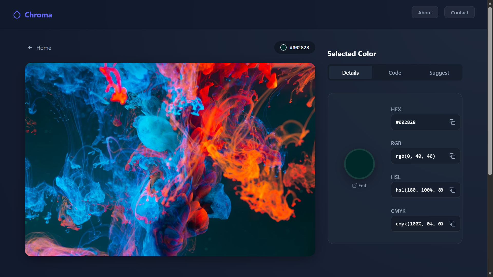

# Chroma: Color Picker

_Testing the capabilities of antigravity_

**AI ho toh kya kuch nahi ho sakta 😁**

Created this project to test what is this all AI hype about, took me around 2-3 hours to build this tool. Not gonna lie am impressed, this is exactly what I wanted and I got it.

A professional-grade, privacy-first color extraction and manipulation tool built for developers and designers.


[Live Preview](https://easycolorpicker.vercel.app)

## Screenshot

<p align="center">

</p>

## Features

- **Smart Extraction**: Automatically identifies dominant colors from any image (Drag & Drop support).
- **Precision Magnifier**: A stationary 3x zoom window for pixel-perfect color picking without obstruction.
- **Developer Ready**:
  - Instantly copy **HEX**, **RGB**, **HSL**, or **CMYK** values.
  - Generate **Vanilla CSS** or **Tailwind CSS** snippets (Backgrounds, Text, Borders).
- **Color Intelligence**:
  - Auto-generated **Tints** (Hover states).
  - Auto-generated **Shades** (Active states).
  - **Harmonies**: Analogous, Triadic, and Split-Complementary schemes.
- **Privacy First**: All image processing happens client-side in the browser. No uploads.

## Tech Stack

- **Frontend**: React, TypeScript, Vite
- **Styling**: Vanilla CSS (Custom Variables, Glassmorphism design system)
- **No External Utils**: Custom color math implementation (Small footprint)

## Getting Started

### Prerequisites

- Node.js (v18+)
- npm

### Installation

1.  Clone the repository:

    ```bash
    git clone https://github.com/arundada9000/color-picker.git
    cd color-picker
    ```

2.  Install dependencies:

    ```bash
    npm install
    ```

3.  Run the development server:

    ```bash
    npm run dev
    ```

4.  Open `http://localhost:5173` in your browser.

## Usage Guide

1.  **Start**: Upload an image or use the "Try Demo" button.
2.  **Pick**: Hover over the image to inspect. Click to "freeze" a color selection.
3.  **Refine**: Click the active color circle to manually adjust the color using the system picker.
4.  **Use**:
    - **Code Tab**: Get copy-paste CSS/Tailwind code.
    - **Suggest Tab**: Find matching design tokens.

## Power Features (New!)

- **Smart Context Menu** (Right-Click):
  - **Pick from Screen**: Use the EyeDropper API to pick colors from _other_ apps or windows.
  - **Save to Palette**: Quickly save a color for later.
  - **Quick Copy**: One-click access to values.
- **Keyboard Shortcuts**:
  - `Ctrl + C`: Smart Copy (Copies HEX in details view, copies CSS class in Code view).
  - `Ctrl + V`: Paste any HEX code validates and loads it instantly.
  - `/`: Focus the manual input field.
  - `Esc`: Close all Modals.

## License

This project is open source and available under the fair use.

_**Arun Neupane**_
